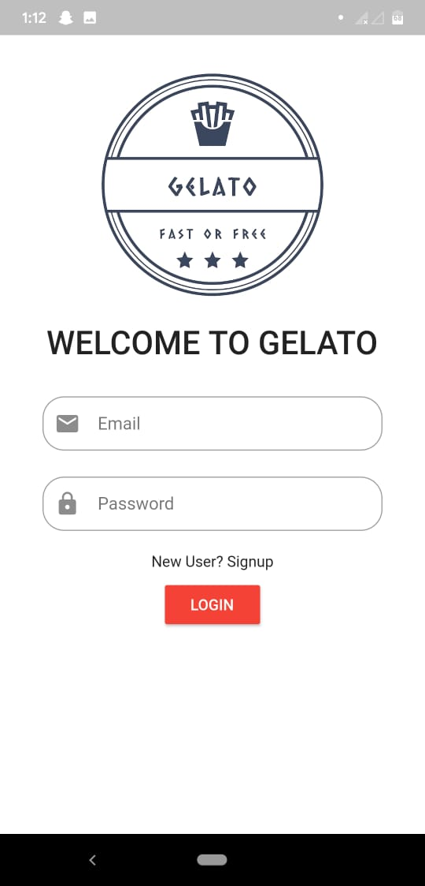

# GELATO

A new Flutter application.

## Getting Started

This is an application for ordering food online . User authentication is done by firebase
[Sample Work : ](https://drive.google.com/open?id=1sd0IUILB8TvepZ-1exG6MbtAcbfRx6s)

A few resources to get you started if this is your first Flutter project:

- [Lab: Write your first Flutter app](https://flutter.dev/docs/get-started/codelab)
- [Cookbook: Useful Flutter samples](https://flutter.dev/docs/cookbook)

For help getting started with Flutter, view our
[online documentation](https://flutter.dev/docs), which offers tutorials,
samples, guidance on mobile development, and a full API reference.

